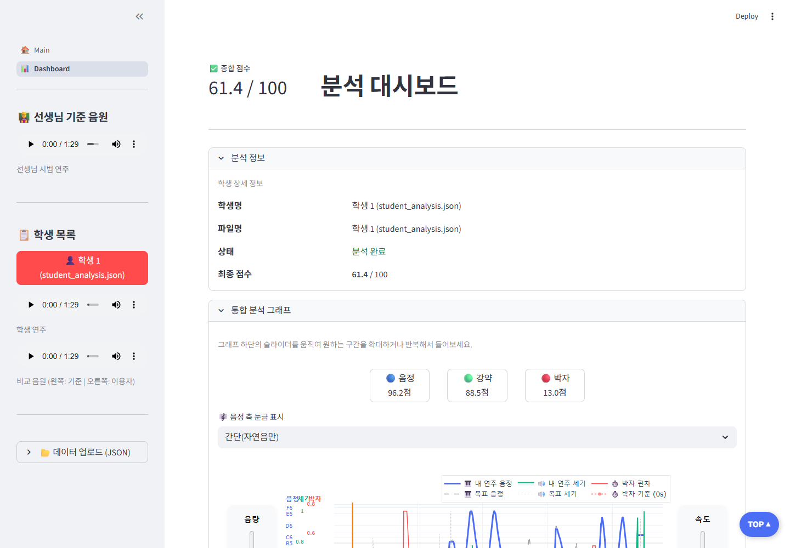
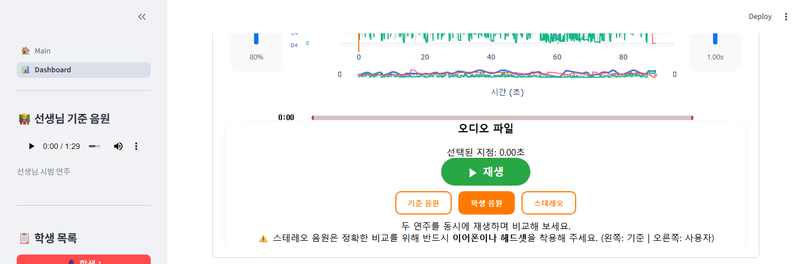
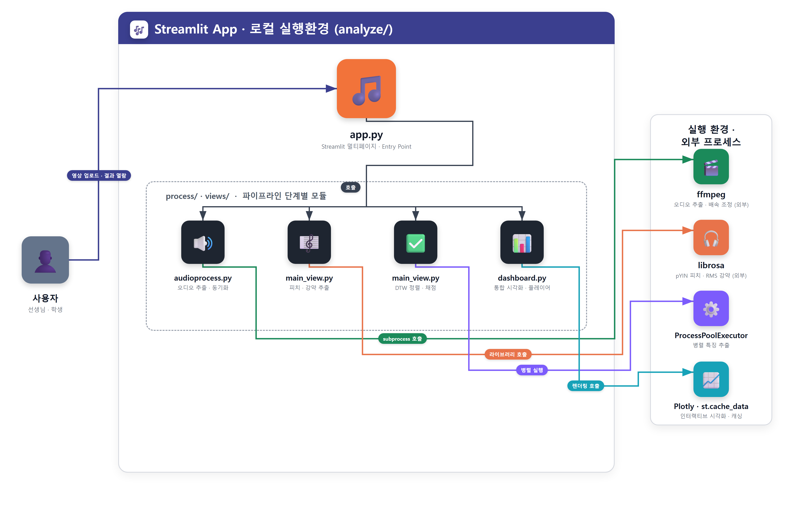

# 🎶 BoomClass — 연주 정밀 분석 시스템


선생님의 시범 연주 영상과 학생의 연주 영상을 비교해서 **음정 · 강약 · 박자** 세 가지 축으로 정밀하게 분석하고 점수를 매겨주는 Streamlit 기반 웹 대시보드입니다. 오디오 신호처리(pYIN 피치 추출, DTW 시간 정렬)를 통해 두 연주의 미묘한 차이를 자동으로 찾아내고, 인터랙티브한 그래프로 시각화해줍니다.

## 목차

- [데모](#데모)
- [주요 기능](#주요-기능)
- [기술 스택](#기술-스택)
- [아키텍처 / 처리 파이프라인](#아키텍처--처리-파이프라인)
- [운영·성능 관점 하이라이트](#운영성능-관점-하이라이트)
- [프로젝트 구조](#프로젝트-구조)
- [시작하기](#시작하기)
- [사용 방법](#사용-방법)
- [데모 자료 더 만들기](#데모-자료-더-만들기)

## 데모

**🔗 라이브 데모: [boomclassproject.streamlit.app](https://boomclassproject-tbvxriteyahakhhn5wkamg.streamlit.app/)** — Dashboard 페이지는 샘플 데이터가 자동으로 로드되어 바로 결과를 확인할 수 있습니다. (Main 분석 페이지는 원본 영상 미포함으로 데모에서 비활성화)

`analyze/student_analysis.json` 샘플 데이터를 Dashboard 페이지에 업로드했을 때의 실제 실행 화면입니다.



음정(파랑) · 강약(초록) · 박자(빨강)를 하나의 그래프에서 토글로 켜고 끄며 비교할 수 있고, 그래프를 클릭하면 해당 지점의 소리를 바로 들을 수 있습니다.



그래프 하단의 커스텀 플레이어에서 기준 음원 · 학생 음원 · 스테레오(좌우 비교) 음원을 전환하며 재생할 수 있습니다.

## 주요 기능

- **영상 자동 동기화**: `ffmpeg`으로 두 영상에서 무음 구간을 잘라내고, 재생 길이가 다른 두 연주의 배속을 자동 계산해 맞춥니다.
- **음정/강약 추출**: `librosa`의 pYIN 알고리즘으로 음정(MIDI pitch)을, RMS로 강약(다이내믹)을 프레임 단위로 추출합니다.
- **DTW 시간 정렬**: 두 연주의 템포가 달라도 Dynamic Time Warping으로 프레임을 정렬해 같은 음을 서로 비교합니다.
- **정량 채점**: 음정(40%) · 강약(20%) · 박자(40%) 가중치로 종합 점수를 계산합니다.
- **인터랙티브 그래프**: Plotly 기반 통합 그래프에서 음정/강약/박자를 켜고 끌 수 있고, 그래프를 클릭하면 해당 지점의 오디오가 바로 재생됩니다. 그래프를 드래그해서 구간을 선택하면 A-B 구간 반복 재생도 가능합니다.
- **결과 저장/재열람**: 분석 결과를 JSON으로 다운로드해두면, 다시 분석을 돌리지 않고도 대시보드에 업로드해서 즉시 재열람할 수 있습니다.

## 기술 스택

| 영역 | 사용 기술 |
|---|---|
| 웹 프레임워크 | Streamlit (멀티페이지) |
| 시각화 | Plotly (인터랙티브 그래프), 커스텀 HTML/CSS/JS (동기화된 오디오 플레이어, 클릭 시크, 구간 반복) |
| 오디오 신호처리 | librosa (pYIN 피치 추출, HPSS, RMS, DTW), scipy (median filter, gaussian smoothing) |
| 미디어 처리 | pydub + ffmpeg (오디오 추출, 무음 트리밍, 배속 조정, 스테레오 합성) |
| 데이터 처리 | numpy, pandas |

## 아키텍처 / 처리 파이프라인



세부 파일/함수 단위 흐름은 아래와 같습니다.

1. **오디오 추출/동기화** (`analyze/process/audioprocess.py`)
   두 영상에서 무음 구간을 잘라 실제 연주 구간만 남기고(`get_audio_bounds`), 두 연주의 길이 비율을 계산해(`calculate_speed_rate`) `ffmpeg`으로 배속을 맞춰 오디오를 추출합니다. 좌우 채널에 각각 넣어 비교용 스테레오 음원도 만듭니다.
2. **특징 추출** (`analyze_features_core`, `analyze/views/main_view.py`)
   `librosa.pyin`으로 음정을(HPSS로 하모닉 성분만 분리 후), RMS로 강약을 추출하고 median filter + gaussian smoothing으로 노이즈를 정리합니다.
3. **시간 정렬 및 채점**
   두 연주의 피치 시퀀스를 DTW로 정렬해 프레임 단위로 매칭하고, 음정/강약/박자 각각의 오차를 계산해 정확도 점수를 산출합니다.
4. **결과 시각화** (`analyze/views/dashboard.py` + `analyze/static/dashboard/*`)
   Plotly로 그린 그래프를 커스텀 오디오 플레이어와 함께 하나의 컴포넌트로 합쳐서, 그래프 클릭/드래그와 오디오 재생이 서로 연동되도록 만들었습니다.

## 운영·성능 관점 하이라이트

데이터 분석 프로젝트지만, 처리 파이프라인 곳곳에 리소스 최적화·외부 프로세스 관리·재현 가능한 환경 구성 같은 운영 관점의 고민이 들어 있습니다.

| 포인트 | 적용 내용 | 코드 위치 |
|---|---|---|
| **병렬 처리** | `ProcessPoolExecutor`로 기준/학생 두 음원의 특징 추출을 동시에 실행해 분석 시간 단축 | `main_view.py` → `run_parallel_analysis` |
| **외부 프로세스 관리** | `subprocess.Popen`으로 `ffmpeg`를 호출하고, 결과를 디스크에 파일로 쓰지 않고 `stdout` 파이프(`pipe:1`)로 바로 스트리밍 처리 · 종료 코드(`returncode`) 체크 후 예외 처리 | `audioprocess.py` → `generate_processed_audio_bin` |
| **성능/정확도 트레이드오프 튜닝** | 분석용 샘플링레이트를 44.1kHz → 16kHz로 낮추고 `hop_length`를 조정해 연산량 절감. 전체 분석 소요시간 155.97초 → 31.54초(약 80% 단축)로 측정됐고, 원본(44.1kHz) 대비 음정 분석 결과는 상관계수 0.97로 유지됨을 별도 실험으로 검증 | `main_view.py` → `analyze_features_core` |
| **예외적 입력값 처리** | `ffmpeg`의 `atempo` 필터가 0.5~2.0배속만 지원하는 제약을, 배속이 그 범위를 벗어나면 필터를 체이닝하는 방식으로 우회 | `audioprocess.py` → `get_atempo_filter` |
| **재연산 방지 캐싱** | `@st.cache_data`로 동일 입력에 대한 중복 분석을 방지 | `main_view.py` → `run_parallel_analysis` |
| **재현 가능한 실행 환경** | `requirements.txt` + 설치/실행 가이드로 동일한 분석 환경을 다른 머신에서도 그대로 재현 가능하도록 문서화 | `requirements.txt`, 본 문서 |
| **대용량 아티팩트 관리** | 원본 영상(수십 MB)은 `.gitignore`로 저장소에서 배제하고, 산출물(JSON)만 포함해 클론 용량을 최소화 | `.gitignore` |

## 프로젝트 구조

```
BoomClass_Project/
├── analyze/
│   ├── app.py                    # Streamlit 진입점 (멀티페이지 네비게이션 구성)
│   ├── student_analysis.json     # 샘플 분석 결과 (데모용, 대시보드에 바로 업로드 가능)
│   ├── input/                    # 원본 연주 영상 (.gitignore 처리, 로컬에만 존재)
│   ├── process/
│   │   └── audioprocess.py       # 영상 → 오디오 추출, 무음 트리밍, 배속 동기화, 스테레오 합성
│   ├── views/
│   │   ├── main_view.py          # [분석] 페이지: pYIN/RMS 추출 → DTW 정렬 → 채점 → JSON 다운로드
│   │   └── dashboard.py          # [대시보드] 페이지: 통합 그래프, 구간별 상세 분석
│   └── static/
│       ├── main_view/            # 선생님/학생 영상 동시 재생 위젯 (YouTube API 기반)
│       └── dashboard/            # 통합 그래프 + 커스텀 오디오 플레이어 컴포넌트
├── docs/
│   ├── architecture.png           # 아키텍처 다이어그램
│   └── screenshots/                # README 데모 스크린샷
├── requirements.txt
└── README.md
```

## 시작하기

### 사전 준비물

- Python 3.10 이상
- [ffmpeg](https://ffmpeg.org/download.html) (시스템 PATH에 등록되어 있어야 함 — 오디오 추출/배속 조정에 사용)

### 설치

```bash
git clone https://github.com/donghoenlee/BoomClass_Project.git
cd BoomClass_Project
python -m venv venv
venv\Scripts\activate          # Windows
# source venv/bin/activate     # macOS/Linux
pip install -r requirements.txt
```

### 실행

```bash
cd analyze
streamlit run app.py
```

`main_view.py`가 `./input/...` 상대 경로로 영상을 참조하기 때문에, 반드시 `analyze` 폴더 안에서 `streamlit run app.py`를 실행해야 합니다.

## 사용 방법

### A. 새로 분석하기 — Main 페이지

1. `analyze/input/` 폴더에 비교할 두 영상을 넣고, `main_view.py`의 `VIDEO_P3`(기준), `VIDEO_USER`(학생) 경로를 맞춥니다.
2. **🚀 구간별 정밀 분석 시작** 버튼을 누르면 오디오 추출 → 피치/강약 추출 → DTW 정렬 → 채점이 자동으로 수행됩니다.
3. 분석이 끝나면 결과를 JSON으로 다운로드할 수 있습니다.

### B. 저장된 결과 열람하기 — Dashboard 페이지

1. 사이드바에서 JSON 파일을 업로드합니다. (`analyze/student_analysis.json` 샘플로 바로 확인 가능)
2. 학생 목록에서 이름을 선택합니다.
3. 통합 그래프에서 음정/강약/박자를 켜고 끄며 비교하고, 그래프를 클릭해 원하는 지점의 소리를 들어봅니다.
4. 그래프를 드래그해서 구간을 선택하면 그 구간만 확대되고, 해당 구간이 반복 재생됩니다.

## 데모 자료 더 만들기

위 스크린샷은 `analyze/student_analysis.json` 샘플 데이터를 Dashboard 페이지에 업로드해서 캡처한 것입니다. 이 저장소에는 실제 영상 파일이 용량 문제로 포함되어 있지 않지만(`analyze/input/*.mp4`), 샘플 JSON이 이미 포함되어 있어서 영상이나 `ffmpeg` 없이도 Dashboard 페이지에서 바로 결과를 확인하고 추가로 캡처할 수 있습니다.

1. `streamlit run app.py` 실행 후 Dashboard 페이지로 이동
2. 사이드바에서 `analyze/student_analysis.json` 업로드 → 학생 선택
3. 원하는 화면을 스크린샷으로 저장 (Windows: `Win + Shift + S`)
4. 인터랙션(그래프 클릭 → 오디오 재생, 구간 반복 등)까지 보여주고 싶다면 화면 녹화 후 GIF로 변환
   - Windows: [ScreenToGif](https://www.screentogif.com/) (무료, 녹화 후 바로 GIF로 저장 가능)
5. `docs/screenshots/` 폴더에 이미지를 추가하고, 이 README의 [데모](#데모) 섹션에 경로를 연결

[Streamlit Community Cloud](https://streamlit.io/cloud)에 실제로 배포해서 위 [데모](#데모) 링크로 공개해뒀습니다. `ffmpeg`는 `packages.txt`로 시스템 패키지를 지정했고, `requirements.txt`에는 로컬에서 검증한 버전을 정확히 pin해서 배포 환경과 로컬 환경이 어긋나지 않도록 했습니다. 원본 영상은 포함돼 있지 않아 Main(분석) 페이지는 안내 문구만 표시되고, Dashboard 페이지가 샘플 데이터로 데모의 중심 역할을 합니다.
